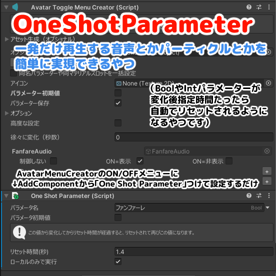

# One Shot Parameter

一発だけ再生する音声やパーティクル等を簡単に実装できるコンポーネント
Components for easy implementation of audio, particles, etc. that play only once

（BoolやIntパラメーターが変化後指定時間たったら自動でリセットされるようになるやつです）

## Install

### VCC用インストーラーunitypackageによる方法（おすすめ）

https://github.com/Narazaka/OneShotParameter/releases/latest から `net.narazaka.vrchat.one-shot-parameter-installer.zip` をダウンロードして解凍し、対象のプロジェクトにインポートする。

### VCCによる方法

1. https://vpm.narazaka.net/ から「Add to VCC」ボタンを押してリポジトリをVCCにインストールします。
2. VCCでSettings→Packages→Installed Repositoriesの一覧中で「Narazaka VPM Listing」にチェックが付いていることを確認します。
3. アバタープロジェクトの「Manage Project」から「One Shot Parameter」をインストールします。

## Usage

アバター内のどこかにインスペクターの「Add Component」ボタンから「OneShotParameter」を付けて、制御したいメニューのパラメーター等を設定します。

### 例: 音声の再生

1. [Avatar Menu Creator for MA](https://avatar-menu-creator-for-ma.vrchat.narazaka.net) で音などのON/OFFメニューを作る
2. そのメニューオブジェクト等に「Add Component」ボタンから「OneShotParameter」を付けて、「パラメーター名」にパラメーター名を指定します。
  - Avatar Menu Creatorではデフォルトでオブジェクト名がパラメーター名です。
3. 音の継続秒数を確認し、「リセット時間(秒)」に指定します。

## License

[Zlib License](LICENSE.txt)
